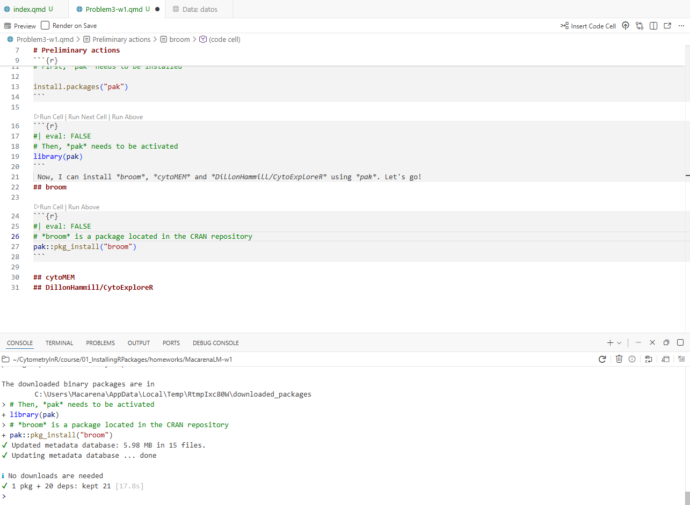

# Preliminary actions

```{r}
#| eval: FALSE
# First, *pak* needs to be installed

install.packages("pak")
```

```{r}
#| eval: FALSE
# Then, *pak* needs to be activated
library(pak)
```
 Now, I can install *broom*, *cytoMEM* and *DillonHammill/CytoExploreR* using *pak*. Let's go!
## broom

```{r}
#| eval: FALSE
# *broom* is a package located in the CRAN repository
pak::pkg_install("broom")
```



## cytoMEM

```{r}
#| eval: FALSE
# *cytoMEM* is a package located in Bioconductor. The code used is the same for the CRAN repository
pak::pkg_install("cytoMEM")
```


## DillonHammill/CytoExploreR

```{r}
#| eval: FALSE
# *DillonHammill/CytoExploreR* is a package from the GitHub repository, and the code is the same that I have previously shown.
pak::pkg_install("DillonHammill/CytoExploreR")
```


This error suggests that is necessary the installation of *EMbedSOM* and *superheat* first


```{r}
#| eval: FALSE
# For *EmbedSOM*:
pak::pkg_install("exaexa/EmbedSOM")
```


```{r}
#| eval: FALSE
# For *superheat*: 
pak::pkg_install("superheat")
```


```{r}
#| eval: FALSE
#Let's try again with *cytoExploreR* from the GitHub repository:
pak::pkg_install("DillonHammill/CytoExploreR")
```


Now, the error seems to be related with the version of the package. I wasn't be able to find a newer version of *superheat*, so I'm going to try to install *CytoExploreR* without using *pak*.

```{r}
#| eval: FALSE
library(remotes)
install_github("DillonHammill/CytoExploreR")
```


So, finally, CytoExploreR is installed. Although *pak* has one code for all repositories and this is an andvantage, seems to give some problems with the installation of some packages.